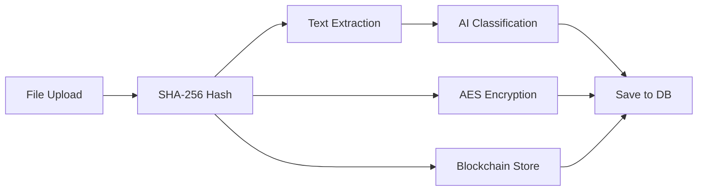
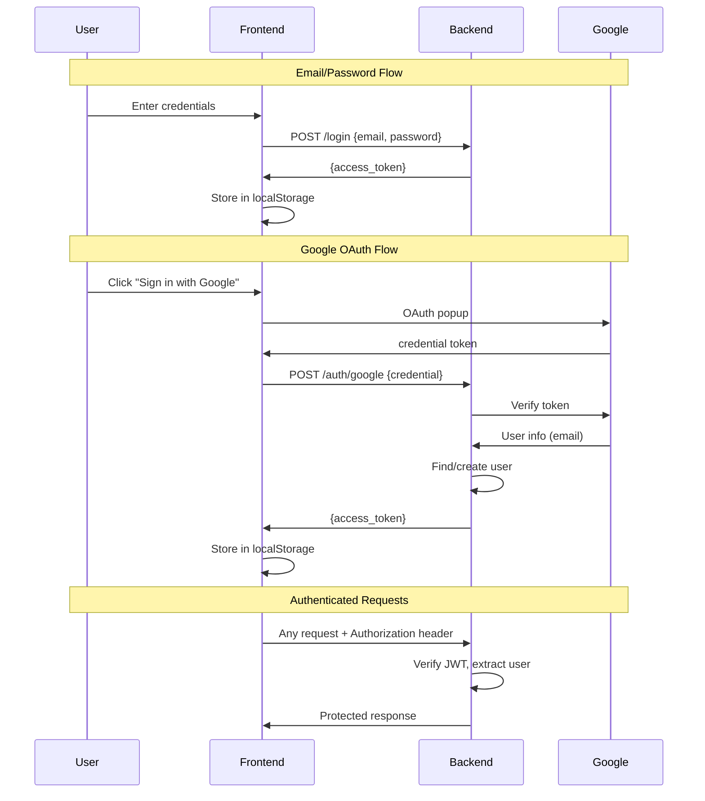

# Timeless Vault — Frontend Design Document

> **A blockchain-powered digital vault for securing, encrypting, and inheriting important documents.**

---

## 1. App Overview

Timeless Vault is a secure document management platform that combines **AES encryption**, **SHA-256 hashing**, **blockchain verification**, and **AI-powered classification** to protect digital assets. Users can upload sensitive documents, assign nominees for inheritance, and manage access requests — all verified on-chain.

### Tech Stack
| Layer | Technology |
|-------|-----------|
| Framework | React 19 + Vite |
| Styling | Tailwind CSS 3 |
| Routing | React Router v7 |
| HTTP Client | Axios |
| Auth | JWT + Google OAuth 2.0 |
| Backend | FastAPI (Python) |
| Database | PostgreSQL |
| Blockchain | Solidity (Hardhat) |

---

## 2. Design System

### Color Palette
| Token | Value | Usage |
|-------|-------|-------|
| `bg-primary` | `gray-950` | Page background |
| `bg-surface` | `gray-900` | Cards, modals, navbar |
| `bg-input` | `gray-800` | Form inputs |
| `accent` | `purple-600` | Primary buttons, links |
| `accent-hover` | `purple-700` | Button hover states |
| `danger` | `red-500` | Logout, delete actions |
| `success` | `green-600` | Approve, verified states |
| `text-primary` | `white` | Headings, body text |
| `text-secondary` | `gray-300` | Descriptions |
| `text-muted` | `gray-500` | Hashes, timestamps |
| `divider` | `gray-700` | Separators |

### Typography
- **Headings**: `text-2xl font-bold` (page titles)
- **Subheadings**: `text-xl font-bold` (section titles)
- **Body**: `text-base` (default)
- **Small**: `text-sm` / `text-xs` (hashes, metadata)

### Component Patterns
- **Cards**: `bg-gray-900 p-6 rounded-xl shadow-lg`
- **Inputs**: `w-full p-2 bg-gray-800 rounded`
- **Primary Button**: `bg-purple-600 p-2 rounded hover:bg-purple-700 transition`
- **Danger Button**: `bg-red-500 px-3 py-1 rounded`
- **Success Button**: `bg-green-600 px-4 py-1 rounded`

---

## 3. Pages & Functionality

### 3.1 Login Page (`/`)

**Purpose**: Authenticate existing users.

**UI Elements**:
- Card container centered on screen
- Email input field
- Password input field
- "Login" button (primary)
- "— or —" divider
- Google Sign-In button (dark theme)
- "No account? Register" link

**User Flows**:
```
Email/Password Login:
  1. Enter email + password
  2. Click Login
  3. POST /login → receive JWT
  4. Store token in localStorage
  5. Redirect to /dashboard

Google Login:
  1. Click "Sign in with Google"
  2. Google popup → select account
  3. POST /auth/google with credential
  4. Backend verifies token, creates user if new
  5. Receive JWT → redirect to /dashboard
```

**API Calls**:
| Method | Endpoint | Body | Response |
|--------|----------|------|----------|
| POST | `/login` | `{ email, password }` | `{ access_token, token_type }` |
| POST | `/auth/google` | `{ credential }` | `{ access_token, token_type }` |

---

### 3.2 Register Page (`/register`)

**Purpose**: Create a new account.

**UI Elements**:
- Card container centered on screen
- Email input field
- Password input field
- "Register" button (primary)
- "— or —" divider
- Google Sign-Up button (dark theme)
- "Already have an account? Login" link

**User Flow**:
```
1. Enter email + password
2. Click Register
3. POST /register → user created
4. Alert "Registered successfully!"
5. Redirect to Login page
```

**API Calls**:
| Method | Endpoint | Body | Response |
|--------|----------|------|----------|
| POST | `/register` | `{ email, password }` | `{ id, email }` |
| POST | `/auth/google` | `{ credential }` | `{ access_token, token_type }` |

---

### 3.3 Dashboard Page (`/dashboard`) 🔒

**Purpose**: View all vault items belonging to the logged-in user.

**UI Elements**:
- Page heading: "Your Timeless Vault"
- Responsive 3-column grid of VaultCards
- Each card shows:
  - **Category** (AI-classified: Finance, Legal, Crypto, Social, Personal)
  - **Summary** (AI-generated one-liner)
  - **Hash** (SHA-256 fingerprint, truncated)
- Empty state message when no items exist

**User Flow**:
```
1. Page loads → GET /vault/items
2. Display items in grid
3. Click card → (future) view details / verify on blockchain
```

**API Calls**:
| Method | Endpoint | Headers | Response |
|--------|----------|---------|----------|
| GET | `/vault/items` | `Authorization: Bearer <token>` | `[ { id, category, summary, hash, ... } ]` |

---

### 3.4 Upload Page (`/upload`) 🔒

**Purpose**: Upload documents to the encrypted vault.

**UI Elements**:
- Page heading: "Upload to Timeless Vault"
- File input (`<input type="file">`)
- "Upload" button (primary)
- Upload progress/status feedback

**User Flow**:
```
1. Select a file (PDF, text, etc.)
2. Click Upload
3. POST /vault/upload (multipart/form-data)
4. Backend pipeline:
   a. Generate SHA-256 hash
   b. Extract text (PDF/text)
   c. AI classifies → category + summary
   d. Encrypt file with Fernet (AES)
   e. Store hash on blockchain
   f. Save to database
5. Alert "Uploaded successfully!"
```

**Backend Pipeline Visualization**:


**API Calls**:
| Method | Endpoint | Body | Response |
|--------|----------|------|----------|
| POST | `/vault/upload` | `FormData { file }` | `{ message, hash, category, summary }` |

---

### 3.5 Nominees Page (`/nominees`) 🔒

**Purpose**: Add trusted nominees who can inherit vault access.

**UI Elements**:
- Page heading: "Add Nominee to Timeless Vault"
- Nominee email input field
- "Add Nominee" button (primary)

**User Flow**:
```
1. Enter nominee's email
2. Click Add Nominee
3. POST /nominee/add
4. Alert "Nominee added!"
```

**API Calls**:
| Method | Endpoint | Body | Response |
|--------|----------|------|----------|
| POST | `/nominee/add` | `{ nominee_email }` | `{ message }` |

---

### 3.6 Access Requests Page (`/requests`) 🔒

**Purpose**: Manage access requests from nominees.

**UI Elements**:
- Page heading: "Timeless Vault Access Requests"
- List of request cards, each showing:
  - Vault Item ID
  - Current status
  - "Approve" button (green)
- Multi-signature: requires **2 approvals** to grant access

**User Flow**:
```
1. Page loads → GET /access/requests
2. Display pending requests
3. Click Approve on a request
4. POST /access/approve → increments approval_count
5. If approval_count >= 2 → access is granted
```

**API Calls**:
| Method | Endpoint | Body | Response |
|--------|----------|------|----------|
| GET | `/access/requests` | — | `[ { id, vault_item_id, status } ]` |
| POST | `/access/approve` | `{ request_id }` | `{ approval_count, is_approved }` |

---

## 4. Shared Components

### 4.1 Navbar
- **Position**: Top of every page
- **Left**: App title "Timeless Vault" (purple accent)
- **Right** (when authenticated):
  - Dashboard link
  - Upload link
  - Nominees link
  - Requests link
  - Logout button (red)
- **Right** (when not authenticated): Hidden

### 4.2 ProtectedRoute
- Wrapper component that checks `localStorage` for JWT token
- Redirects to Login (`/`) if no token found
- Wraps Dashboard, Upload, Nominees, AccessRequests pages

### 4.3 VaultCard
- Displays a single vault item
- Shows category (purple heading), summary (gray text), hash (muted, monospace)
- Contained in `bg-gray-900 p-6 rounded-xl shadow-lg`

---

## 5. Authentication Architecture



---

## 6. Route Map

| Route | Page | Protected | Description |
|-------|------|-----------|-------------|
| `/` | Login | No | Login with email or Google |
| `/register` | Register | No | Create new account |
| `/dashboard` | Dashboard | Yes | View encrypted vault items |
| `/upload` | Upload | Yes | Upload & encrypt documents |
| `/nominees` | Nominees | Yes | Add inheritance nominees |
| `/requests` | AccessRequests | Yes | Approve multi-sig access |

---

## 7. API Integration Summary

All authenticated requests include `Authorization: Bearer <token>` via Axios interceptor.

| Feature | Method | Endpoint | Auth |
|---------|--------|----------|------|
| Register | POST | `/register` | No |
| Login | POST | `/login` | No |
| Google Auth | POST | `/auth/google` | No |
| Get Profile | GET | `/me` | Yes |
| List Vault Items | GET | `/vault/items` | Yes |
| Upload File | POST | `/vault/upload` | Yes |
| Verify Hash | GET | `/vault/verify/{id}` | Yes |
| Add Nominee | POST | `/nominee/add` | Yes |
| Request Access | POST | `/access/request/{id}` | Yes |
| Approve Access | POST | `/access/approve/{id}` | Yes |

---

## 8. File Structure

```
src/
├── api/
│   └── axios.js            # Axios instance + JWT interceptor
├── components/
│   ├── Navbar.jsx           # Top navigation bar
│   ├── ProtectedRoute.jsx   # Auth guard wrapper
│   └── VaultCard.jsx        # Vault item display card
├── pages/
│   ├── Login.jsx            # Login + Google OAuth
│   ├── Register.jsx         # Registration + Google OAuth
│   ├── Dashboard.jsx        # Vault items grid
│   ├── Upload.jsx           # File upload form
│   ├── Nominees.jsx         # Nominee management
│   └── AccessRequests.jsx   # Access request approval
├── App.jsx                  # Router + layout
├── App.css                  # App-level styles
├── index.css                # Tailwind directives + body
└── main.jsx                 # Entry point + GoogleOAuthProvider
```
